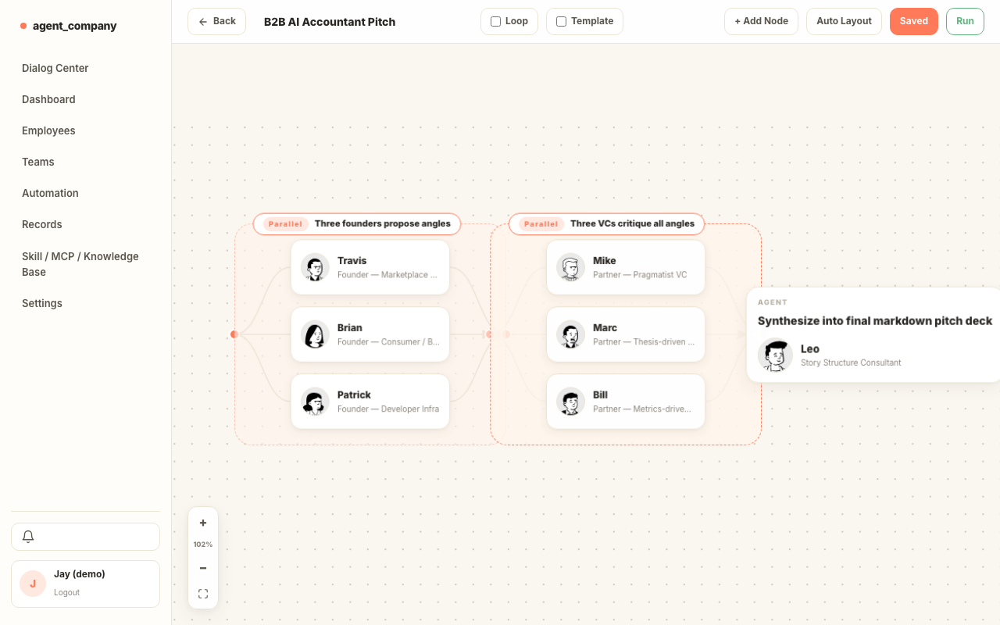
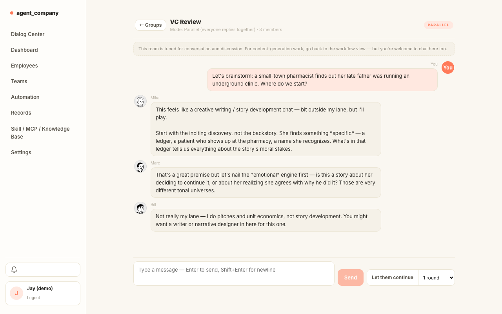
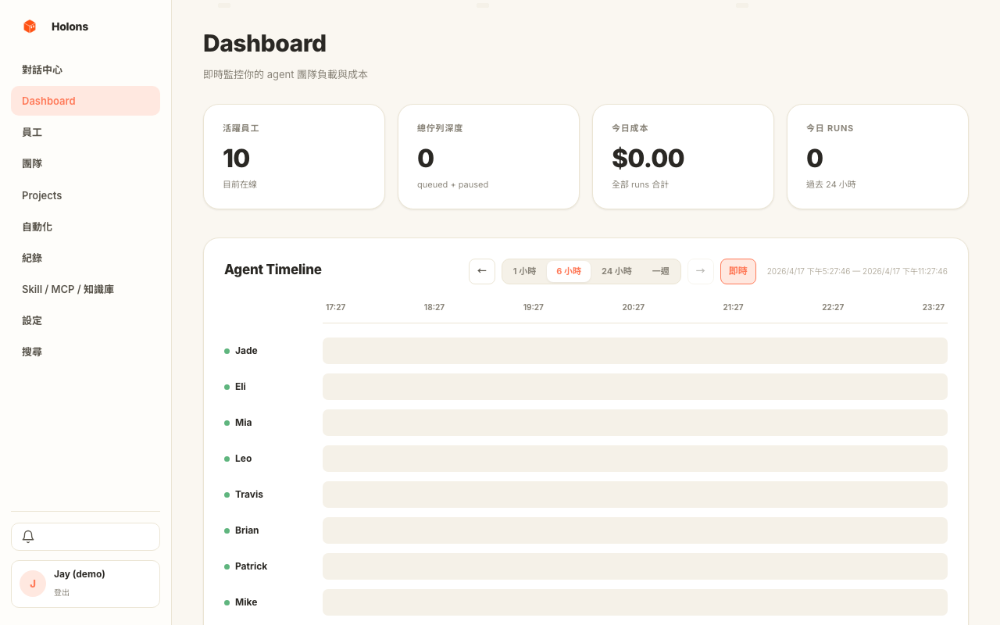
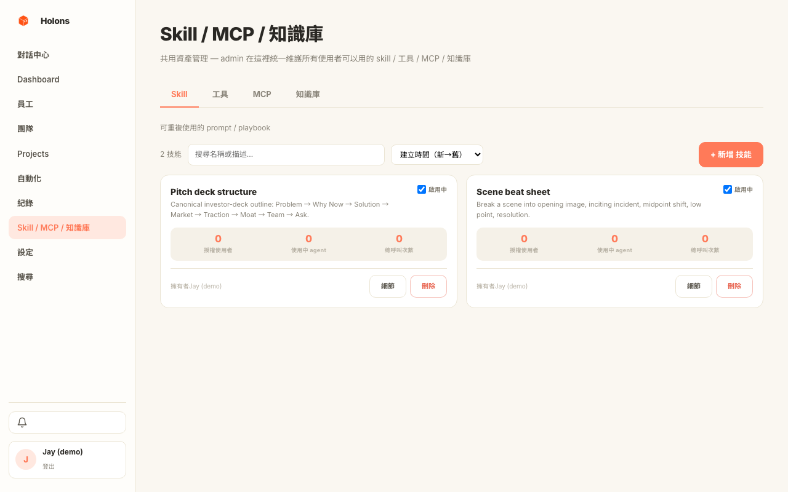
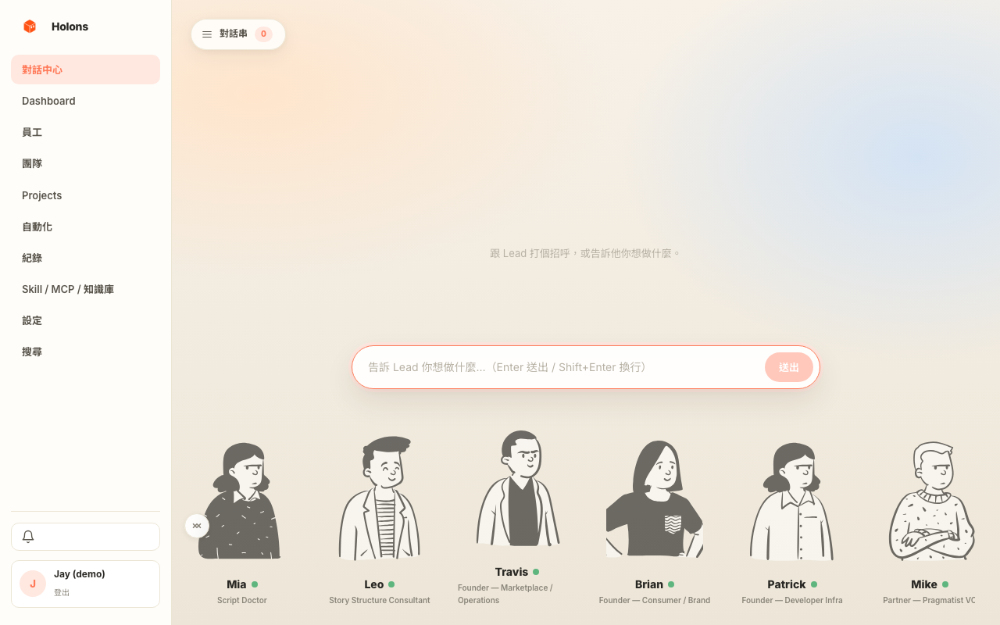
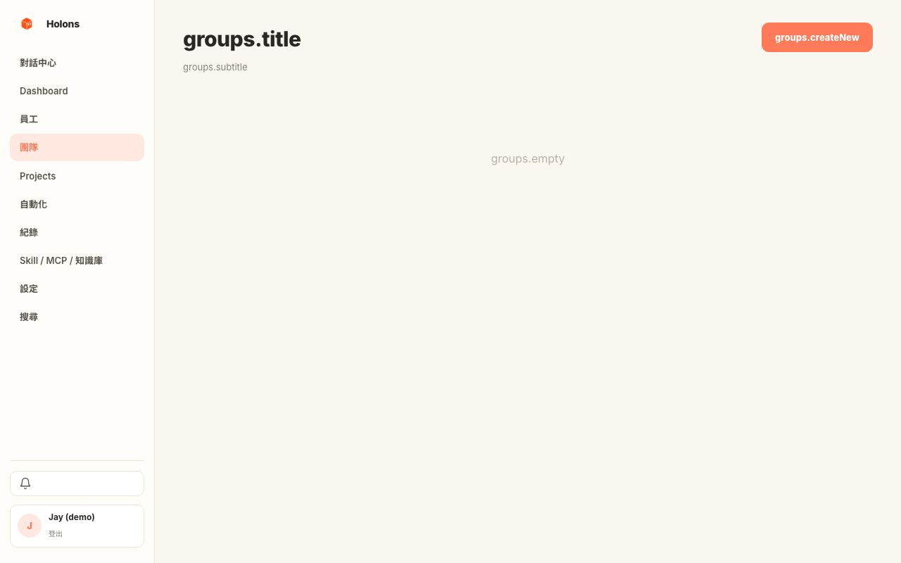
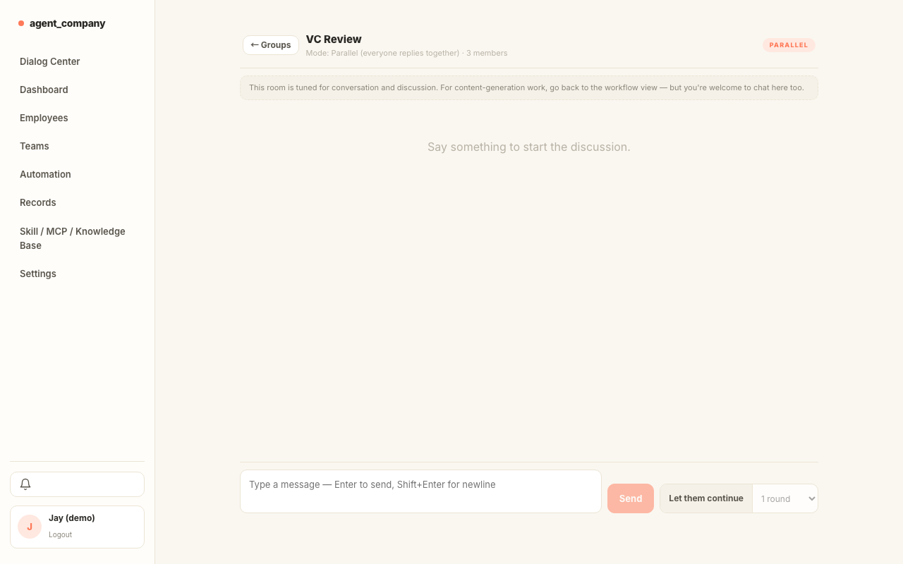
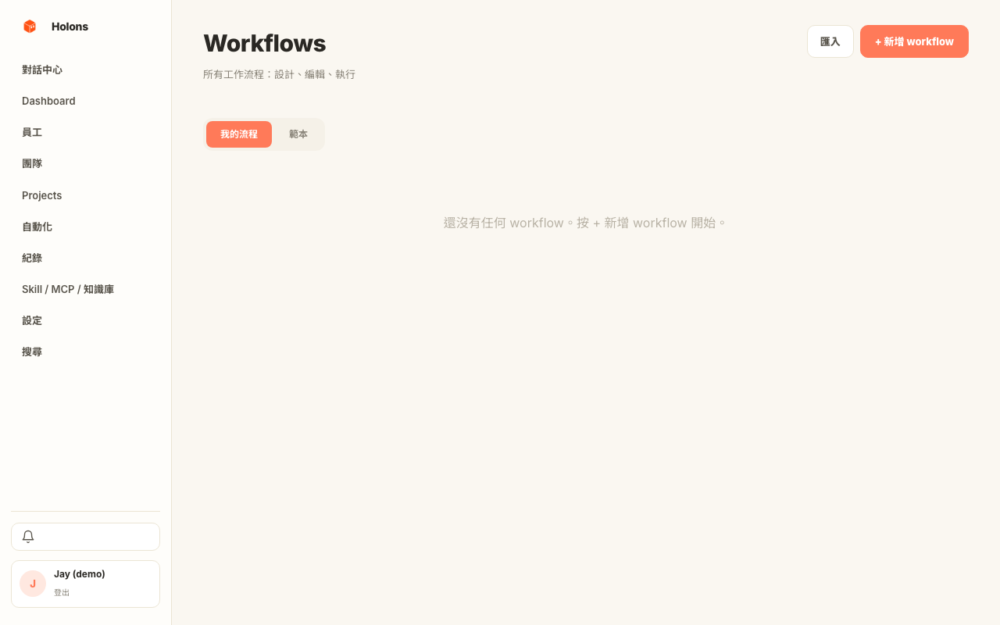

<div align="center">


# Holons

**Your AI company, on your own machine.**
Hire a team of AI agents, give each one a name and a role, assign work
from a chat window, and watch the output land.
A one-person shop today, a whole department tomorrow — same app,
swappable backing DB.

> *"A Holon is both a whole and a part. Each agent in Holons is autonomous
> enough to handle its own work, yet composes cleanly into a larger team."*
> — after Arthur Koestler, *The Ghost in the Machine* (1967)

[](LICENSE)
[](https://github.com/jhk482001/Holons/actions/workflows/ci.yml)
[](https://github.com/jhk482001/Holons/releases)
[](https://github.com/jhk482001/Holons/stargazers)

</div>


> ### Talk to Lead in your own words → get a runnable multi-agent workflow in seconds.
>
> Type the job the way you'd say it to a colleague — *"spin up a pitch
> for a B2B AI accountant"* or *"review this chapter for pacing and
> consistency"*. Lead picks who on your team should do what, drafts the
> workflow, shows a cost estimate, and hands you **Edit / Save / Run
> Now**. No YAML, no graph-coding, no framework to learn.
>
> 🎬 **[Watch the full walkthrough](docs/assets/demo-walkthrough.webm)** — login → dialog → groups → group chat → workflow editor → dashboard → library.

---

## ⚡ Quick start

Pick one of three modes. Personal is by far the easiest.

### Personal desktop (recommended)

Download the latest `.dmg` / `.msi` / `.AppImage` from
[Releases](https://github.com/jhk482001/Holons/releases), install,
launch, and log in with **`admin` / `admin`**. The app bundles a Python
sidecar with SQLite — no Docker, no API keys to set up.

> **macOS**: builds are unsigned. First launch: right-click → Open → Open
> Anyway. Standard for open-source apps without a paid signing cert.
>
> To uninstall or fully reset to the first-run state, see
> [docs/BUILD.md#uninstall--full-reset-macos](docs/BUILD.md#uninstall--full-reset-macos).
> Dragging the `.app` to Trash alone leaves your login and local DB behind
> in `~/Library/Application Support/com.holons.desktop/` and `~/.agent_company/`.

### Self-host (local dev or server)

Requires Python 3.9+, Node 18+, Rust (for the desktop build), Docker for
the Postgres option.

```bash
git clone https://github.com/jhk482001/Holons.git
cd Holons

cp .env.example .env
pip install -r requirements.txt
cd frontend && npm install && cd ..

# --- Backend ---
# Easiest: SQLite, single binary, auto-provisions admin user.
python -m backend.standalone --port 8087
# Or: Postgres (docker compose up -d postgres first), multi-user ready.
# python -m backend.app

# --- Frontend (second shell) ---
cd frontend && npm run dev        # http://localhost:5173

# Optional: seed demo user + two showcase teams
python -m demo.seed_demo
```

Login: `admin` / `admin`, or `jay` / `demo` after running the seed.

### Managed / production deploy

See **[docs/BUILD.md](docs/BUILD.md)** for Docker, TLS, reverse proxy, and
the GitHub Actions release pipeline.

---

## 🎯 Why this, instead of another framework

Most multi-agent projects are **SDKs** (CrewAI, AutoGen, LangGraph) or
**no-code canvases** (Dify, Langflow). Agent Company is neither — it's a
**personal-scale management UI** that treats agents the way an operator
treats a small team:

- **Hire** — each agent has a name, a face, a role title, a system prompt.
- **Assign** — chat with Lead; it decomposes the task and drafts a workflow.
- **Coordinate** — groups fan tasks out in parallel, or round-robin them.
- **Observe** — dashboard shows who's idle, who's busy, what today cost.
- **Review** — open a group chat and sit in the room while they deliberate.

The same app runs as a single binary + SQLite on your laptop, or as a
Postgres-backed multi-user deploy on a server. Works on macOS, Windows,
Linux.

---

## 🧭 A quick tour

### 1. Tell Lead what you want — get a workflow back

The hero shot above is the flagship moment. You type *"spin up a pitch
for a B2B AI accountant"* in plain English; Lead turns it into a
three-stage workflow, picks the right agents off your bench, shows
the cost estimate, and offers **Run Now**. You can run it, edit any
step, or save it as a template for next time.

Lead doesn't only propose workflows. When the team is missing a
specialty, Lead can **propose hiring** — it drafts name, role,
description, and a full system prompt; you click Hire, the agent
exists, ready to take work. When the ask is multi-phase or spans days,
Lead can **propose opening a Project** with members, coordinator,
and cost attribution — you click Accept, the project exists and every
subsequent run lands under it. Both actions are previewed in the chat
as editable cards; nothing is created until you approve.

Lead also answers simple questions directly, flags resource conflicts
("Noah is busy until 3pm"), and proposes the same workflow in the
group chat when you're deliberating with teammates.

🎥 [`videos/01-dialog-workflow-proposal.webm`](docs/assets/videos/01-dialog-workflow-proposal.webm)

### 2. Workflows are visual — and you can always take over

Once Lead proposes (or you hand-build) a workflow, drag nodes, swap
agents, change parallel vs. sequential, override a prompt for one step.
No YAML, no code, no framework-specific DSL.



🎥 [`videos/03-workflow-editor.webm`](docs/assets/videos/03-workflow-editor.webm)

### 3. Sit in a room and talk to a team

A "group chat" is exactly what it sounds like: you, and every agent in a
group, in one thread. Replies come in parallel (everyone answers at once)
or sequential (round-robin, each one reads the last). Hit **"Let them
continue"** and the agents keep riffing without you for 1–10 rounds.



🎥 [`videos/02-group-chat.webm`](docs/assets/videos/02-group-chat.webm)

### 4. Projects bundle the work — and a coordinator writes your daily report

Group runs into a **Project**: give it a goal, allocate a slice of each
agent's daily quota, and pick a coordinator. At day's end the coordinator
writes a short report — status, per-member highlights, budget burn, next
up — and drops it into your Lead thread with a link. Hook a webhook and
it goes to Slack too.

Budgets and quotas are per-agent / per-project, with 80% warnings and
an optional auto-topup that's rate-limited so you don't run a 3am surprise.

→ Deep dive: [docs/PROJECTS.md](docs/PROJECTS.md)

### 5. See who's working — and what it cost

Real-time Gantt of agent activity, today's cost, queue depth per agent,
who's idle vs. over-budget, stacked per-project spend.



🎥 [`videos/04-dashboard.webm`](docs/assets/videos/04-dashboard.webm)

### 6. Plug in the outside world — skills, tools, MCP servers

Share curated skills, built-in tools (HTTP GET, current time, search),
custom MCP servers, and RAG knowledge bases across every agent from one
Library page. Admins gate who can create and share; agents inherit whatever
they've been granted.



🎥 [`videos/05-library.webm`](docs/assets/videos/05-library.webm)

<details>
<summary>More screenshots</summary>

| | |
|---|---|
|  |  |
|  |  |
|  | |

</details>

---

## 📦 Features at a glance

The big surfaces — everything below maps to a tour section above, a
deep-dive doc, or both.

| | | |
|---|---|---|
| 🗣️ **Natural-language → workflow** | 🧩 **Visual workflow editor** | 👥 **Named agents & roles** |
| Talk to Lead; get a runnable flow. | Drag, swap, override per step. | Name, face, role, system prompt. |
| 🧑‍💼 **Lead proposes hires** | 🗂️ **Lead proposes projects** | 🎬 **"Let them continue"** |
| Missing a specialty → Lead drafts one. | Multi-phase work → a project, auto. | 1–10 autonomous rounds. |
| 💬 **Group chat rooms** | 🔁 **Parallel / sequential groups** | 🔄 **Review-loop workflows** |
| Observable deliberation. | Fan-out, round-robin, aggregator. | N iterations, REVISE / APPROVE verdicts. |
| 🗂️ **Projects + quotas** | 📈 **Daily coordinator report** | 💰 **Budget & auto-topup** |
| Goals, members, resource %. | Status / highlights / next-up. | Rate-limited, warn at 80%. |
| 📊 **Dashboard & cost** | 🕐 **Schedules (cron)** | 🔎 **Full-text search** |
| Gantt, stacked spend, idle/busy. | Trigger workflows on a timer. | Across threads, runs, reports. |
| 📔 **Skills library** | 🔧 **Tools (HTTP, time, …)** | 🧠 **RAG knowledge bases** |
| Reusable prompt snippets. | Built-ins + bring-your-own. | pgvector backend; per-agent grants. |
| 🔑 **MCP servers** | 🛂 **Feature flags + admin** | 📨 **Notifications + webhooks** |
| Custom + shared connections. | Who can create/share/use what. | In-app bell + Slack/HTTP fanout. |
| 🪟 **Desktop cast-bar overlay** | 🔌 **API tokens (`hlns_…`)** | 📤 **Export / import** |
| Transparent, click-through. | Long-lived, scoped, rotate-able. | Agents, workflows as JSON. |
| 🌐 **Pluggable LLMs** | 💾 **Swappable backends** | 🌍 **i18n (en / zh-TW)** |
| Bedrock / Anthropic / OpenAI / Gemini / MiniMax. | SQLite (personal) or Postgres + pgvector. | Per-user locale. |

→ Architecture: **[docs/ARCHITECTURE.md](docs/ARCHITECTURE.md)** · Projects deep-dive: **[docs/PROJECTS.md](docs/PROJECTS.md)** · Development: **[docs/DEVELOPMENT.md](docs/DEVELOPMENT.md)**

---

## 🎬 Demo teams

Two showcase setups ship in [`demo/seed_demo.py`](demo/seed_demo.py):

- **Screenwriting Room** — Jade (showrunner), Eli (writer), Mia (script
  doctor), Leo (structure consultant). Writers-room flow.
- **Startup Pitch Council** — three founder archetypes draft a pitch, three
  VC archetypes critique, a final polish pass outputs a markdown pitch deck.

Log in as **`jay`** / **`demo`** and you'll see both teams pre-loaded.

---

## 🗂 Repository layout

```
holons/
├── backend/              Flask app + services (LLM clients, engine, queue, Lead)
├── frontend/             React + Vite web console
├── desktop/              Tauri desktop overlay; embeds the web build
├── demo/                 Showcase seed data + Playwright walkthrough
├── docs/                 Architecture, build, development guides + assets
├── build/                Build scripts (sidecar, dmg)
├── docker-compose.yml    Postgres + pgAdmin for dev
└── .github/workflows/    CI + multi-platform release pipelines
```

---

## 📚 Docs

| | |
|---|---|
| [docs/ARCHITECTURE.md](docs/ARCHITECTURE.md) | How the pieces fit together |
| [docs/BUILD.md](docs/BUILD.md) | Build the desktop binary / Docker image |
| [docs/DEVELOPMENT.md](docs/DEVELOPMENT.md) | Local setup, tests, conventions |
| [CHANGELOG.md](CHANGELOG.md) | Release history |
| [CONTRIBUTING.md](CONTRIBUTING.md) | How to contribute |

---

## 💬 Community

- **Bugs / feature requests** → [GitHub Issues](https://github.com/jhk482001/Holons/issues)
- **Questions / show & tell** → [GitHub Discussions](https://github.com/jhk482001/Holons/discussions)
- **Security** — please email the maintainer rather than filing a public issue.

## 📝 License

[MIT](LICENSE). Use it, fork it, ship it.
